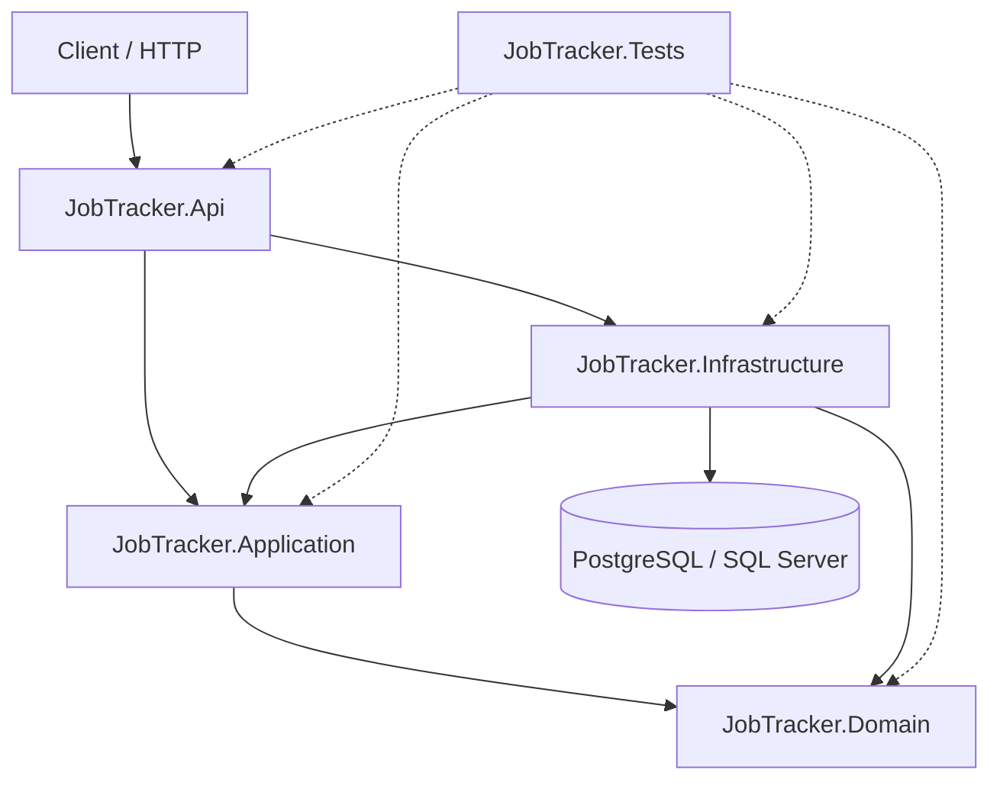

# JobTracker

JobTracker is a .NET API for tracking companies, job applications, statuses, and follow-up reminders.

## Architecture

The solution follows a Clean Architecture style with explicit dependency direction:

- `JobTracker.Domain` contains entities, value rules, status transitions, and domain invariants. It has no project dependencies.
- `JobTracker.Application` contains use cases, validation, result types, pipeline behaviors, and application abstractions. It depends on Domain.
- `JobTracker.Infrastructure` contains EF Core persistence, stores, read services, authentication services, background workers, interceptors, and provider-specific database integration. It depends on Application and Domain.
- `JobTracker.Api` contains controllers, middleware, HTTP configuration, authentication, rate limiting, and API result mapping. It depends on Application and Infrastructure.
- `JobTracker.Tests` references all projects as needed for unit and integration-style tests.



Request flow for a typical write use case:

1. Controller receives HTTP request.
2. MediatR sends a command/query to Application.
3. Validation behavior runs FluentValidation validators.
4. Handler uses feature-specific stores/read services and shared services.
5. Domain entities enforce business invariants.
6. Infrastructure persists changes through EF Core.
7. API maps `Result<T>` to HTTP responses and `ProblemDetails`.

## Project Dependencies

Project references:

- `JobTracker.Api` -> `JobTracker.Application`, `JobTracker.Infrastructure`
- `JobTracker.Application` -> `JobTracker.Domain`
- `JobTracker.Infrastructure` -> `JobTracker.Application`, `JobTracker.Domain`
- `JobTracker.Domain` -> none
- `JobTracker.Tests` -> all projects

Package versions are centrally managed in `Directory.Packages.props`.

Key packages:

- ASP.NET Core JWT Bearer authentication
- EF Core with PostgreSQL and SQL Server providers
- MediatR
- FluentValidation
- BCrypt.Net
- xUnit, FluentAssertions, Moq
- Swashbuckle/OpenAPI

Shared build settings are in `Directory.Build.props`:

- Nullable enabled
- Implicit usings enabled
- .NET analyzers enabled
- Code style enforced in build
- Warnings treated as errors when `CI=true`

## Running PostgreSQL

A local PostgreSQL instance is required when `Database:Provider` is `PostgreSql`.

Example Docker command:

```powershell
docker run --name jobtracker-postgres -e POSTGRES_DB=jobtracker -e POSTGRES_USER=postgres -e POSTGRES_PASSWORD=postgres -p 5432:5432 -d postgres:17
```

Local connection string example:

```text
Host=localhost;Port=5432;Database=jobtracker;Username=postgres;Password=postgres
```

The database provider is selected by configuration:

```json
{
  "Database": {
    "Provider": "PostgreSql"
  }
}
```

Supported provider values:

- `PostgreSql`
- `SqlServer`

## User Secrets

Do not store JWT keys or database passwords in `appsettings.json`.

Initialize and set local secrets from the API project:

```powershell
cd C:\dotnet\JobTracker\src\JobTracker.Api

dotnet user-secrets set "Jwt:Key" "replace-with-a-long-development-signing-key"
dotnet user-secrets set "ConnectionStrings:PostgreSql" "Host=localhost;Port=5432;Database=jobtracker;Username=postgres;Password=postgres"
```

Optional SQL Server secret:

```powershell
dotnet user-secrets set "ConnectionStrings:SqlServer" "Server=localhost;Database=JobTracker;User Id=sa;Password=your-password;TrustServerCertificate=True"
```

Environment variable equivalents:

```powershell
$env:Jwt__Key="replace-with-a-long-development-signing-key"
$env:ConnectionStrings__PostgreSql="Host=localhost;Port=5432;Database=jobtracker;Username=postgres;Password=postgres"
```

## Migrations

Install EF Core CLI if needed:

```powershell
dotnet tool install --global dotnet-ef --version 10.0.9
```

Add a migration:

```powershell
dotnet ef migrations add MigrationName --project C:\dotnet\JobTracker\src\JobTracker.Infrastructure\JobTracker.Infrastructure.csproj --startup-project C:\dotnet\JobTracker\src\JobTracker.Api\JobTracker.Api.csproj --output-dir Persistence\Migrations
```

Apply migrations:

```powershell
dotnet ef database update --project C:\dotnet\JobTracker\src\JobTracker.Infrastructure\JobTracker.Infrastructure.csproj --startup-project C:\dotnet\JobTracker\src\JobTracker.Api\JobTracker.Api.csproj
```

Check for pending model changes:

```powershell
dotnet ef migrations has-pending-model-changes --project C:\dotnet\JobTracker\src\JobTracker.Infrastructure\JobTracker.Infrastructure.csproj --startup-project C:\dotnet\JobTracker\src\JobTracker.Api\JobTracker.Api.csproj --context ApplicationDbContext
```

## Running The API

```powershell
cd C:\dotnet\JobTracker

dotnet restore
dotnet run --project src\JobTracker.Api\JobTracker.Api.csproj
```

Swagger UI is enabled in Development.

## Tests And Quality Gates

Run tests:

```powershell
dotnet test C:\dotnet\JobTracker\JobTracker.slnx
```

Run build with CI rules locally:

```powershell
$env:CI="true"
dotnet build C:\dotnet\JobTracker\JobTracker.slnx --configuration Release
```

Verify formatting:

```powershell
dotnet format C:\dotnet\JobTracker\JobTracker.slnx --verify-no-changes --no-restore
```

Check vulnerable dependencies:

```powershell
dotnet list C:\dotnet\JobTracker\JobTracker.slnx package --vulnerable --include-transitive
```

GitHub Actions CI is defined in `.github/workflows/ci.yml` and documented in `docs/engineering/ci.md`.

## API Authentication

Authentication uses JWT Bearer tokens.

Public endpoints:

- `POST /api/auth/register`
- `POST /api/auth/login`

Protected endpoints require:

```http
Authorization: Bearer <token>
```

Protected controllers include:

- `CompaniesController`
- `JobApplicationsController`

Auth endpoints are rate limited:

- register: 3 attempts per 10 minutes per client partition
- login: 5 attempts per minute per client partition

Login errors use a generic invalid credentials response to avoid revealing whether an email exists.

## Architecture Decisions

Architecture decision records are stored in `docs/adr`:

- `0001-clean-architecture.md`
- `0002-result-pattern-and-problem-details.md`
- `0003-feature-scoped-abstractions.md`
- `0004-time-provider-and-auditing.md`
- `0005-observability-without-opentelemetry-export.md`
- `0006-ci-and-engineering-standards.md`
